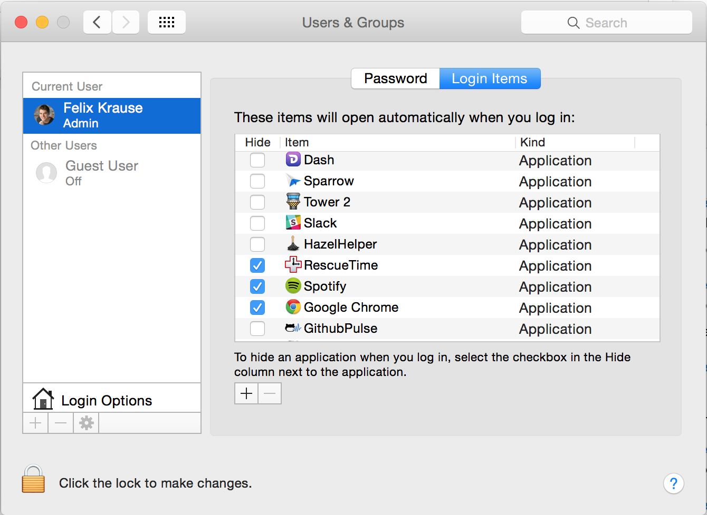
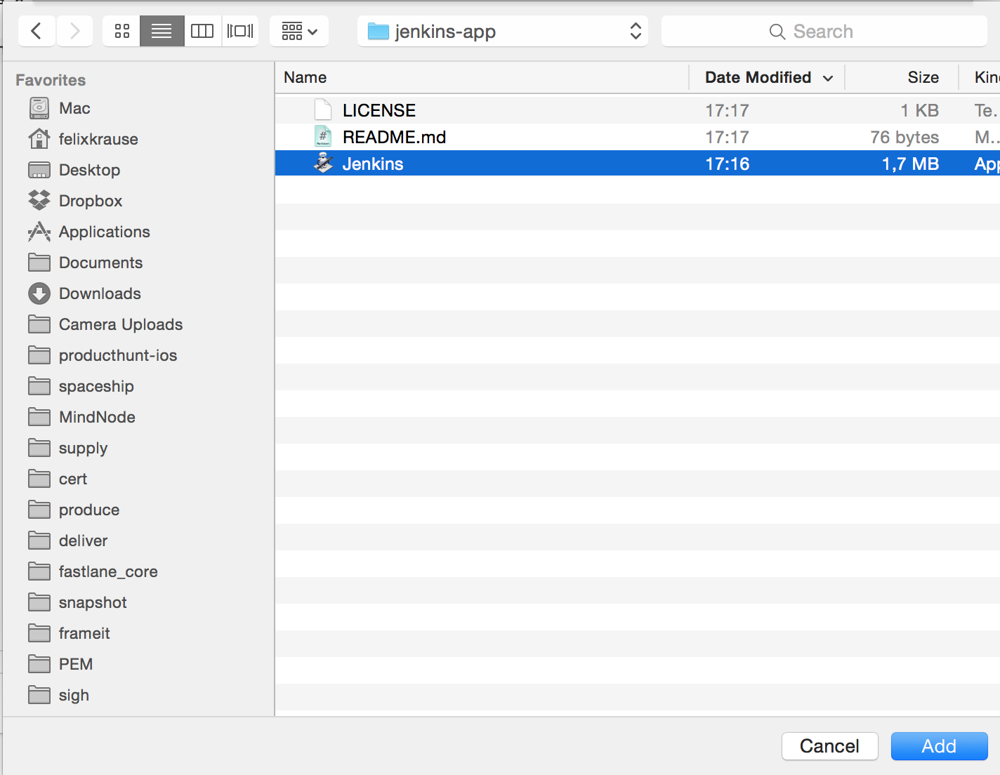

# Brewed Jenkins :beer: 

When you install Jenkins via `homebrew`, there is no way to auto-start it after the Mac booted and still have access to the standard Keychain.

You still want Jenkins to run as a standard user process to have permissions to the Keychain and code signing and easier ways to debug problems.

Introducing `Brewed Jenkins`

### How does it work?

You download a Jenkins app, which does nothing else, but launch the `jenkins` process. Since it is an app, the Mac will launch it as the standard user.

### Getting started

First, install Jenkins using `brew install jenkins`

To enable auto start for Jenkins, follow this guide:

- Download [Brewed Jenkins](https://github.com/fastlane/jenkins-app/releases/download/1.0/Jenkins.zip) and extract it somewhere save on your Mac and follow these steps:
- Start the Jenkins app at least once, to verify you want to run a third party application
- Open System Preferences
- Open `Users & Groups`
- Switch to `Login Items`
- Click the `+`
- Choose the Jenkins file you just downloaded

Celebrate :tada:

